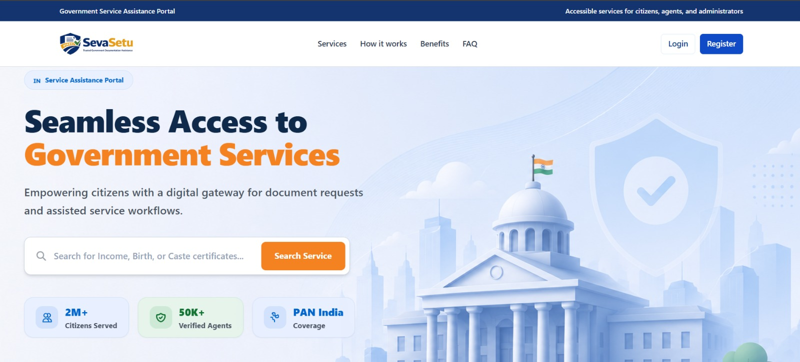
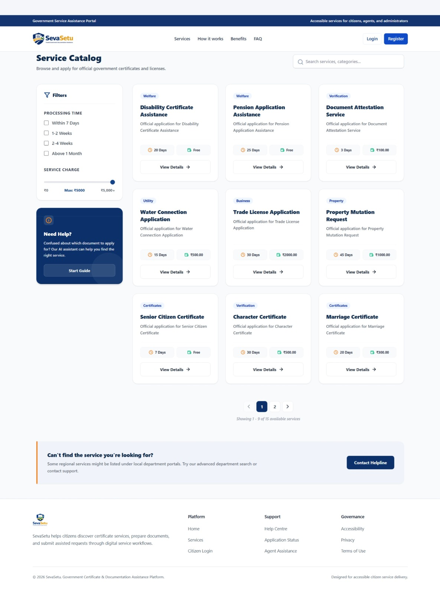
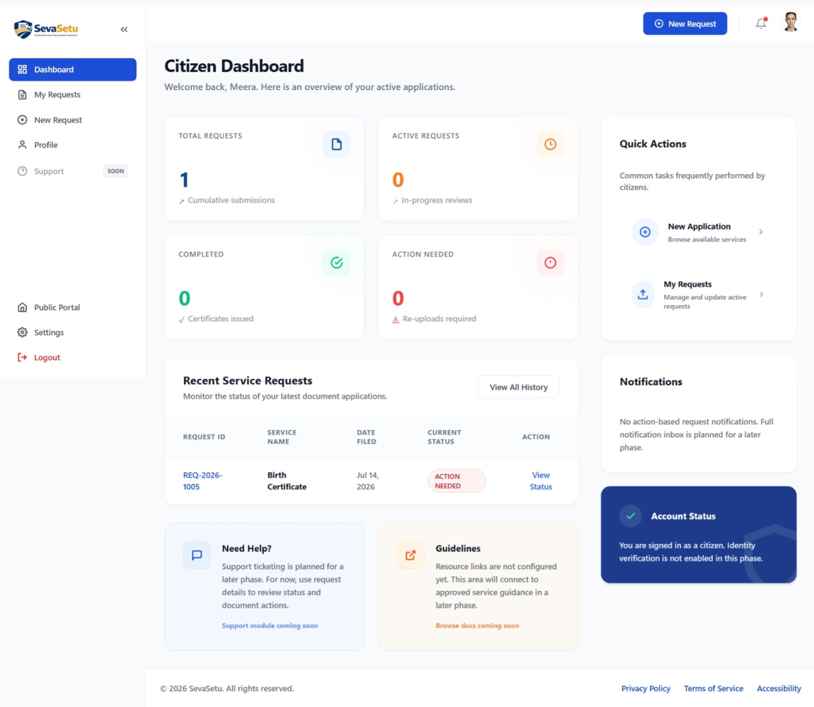
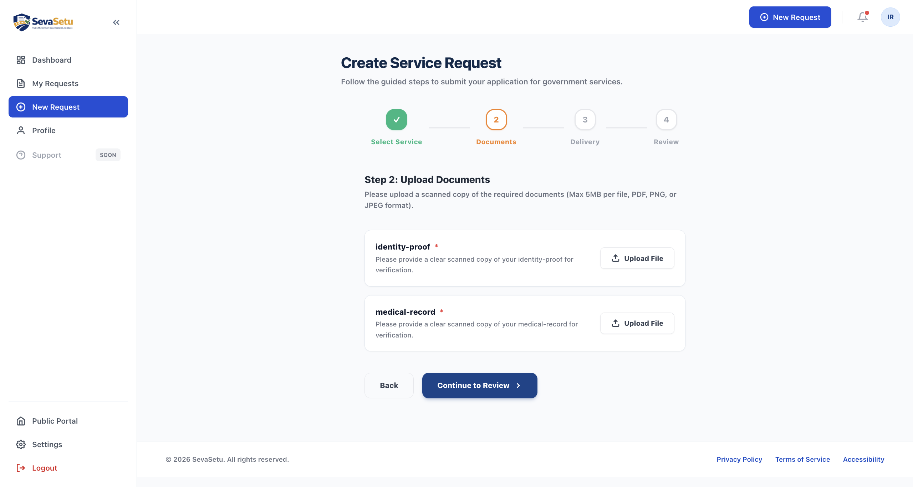
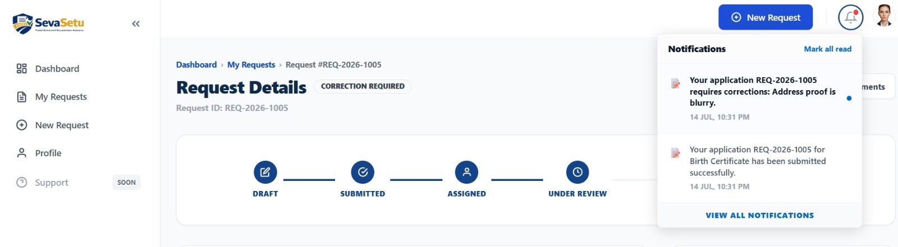
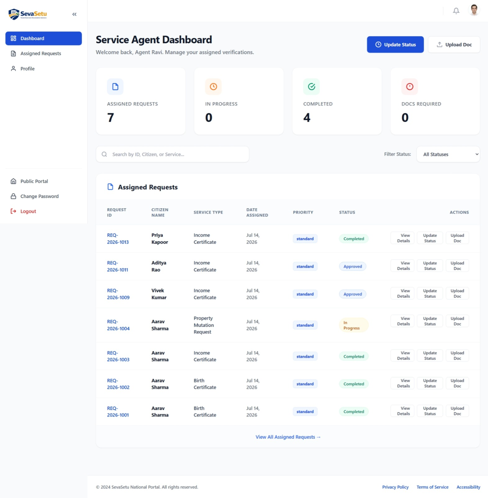
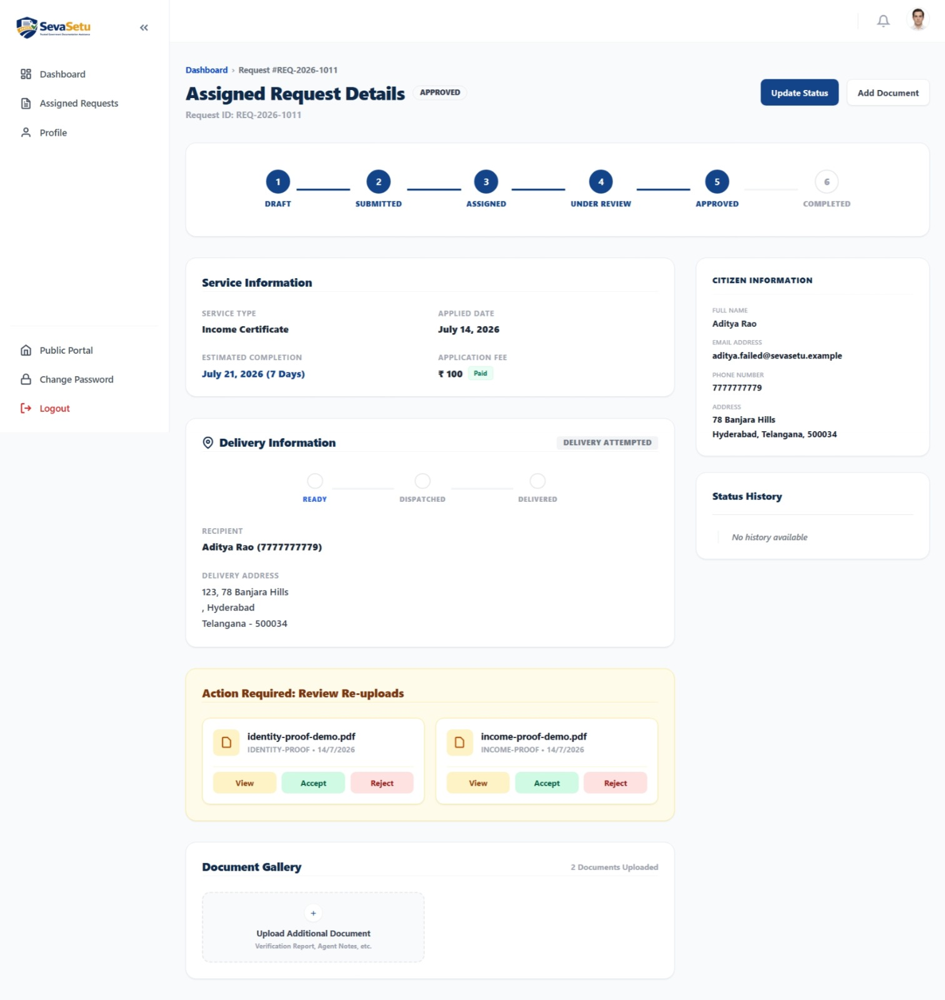
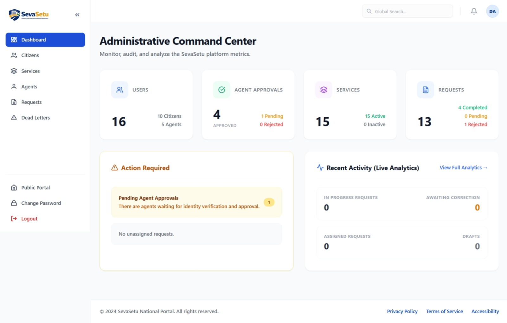
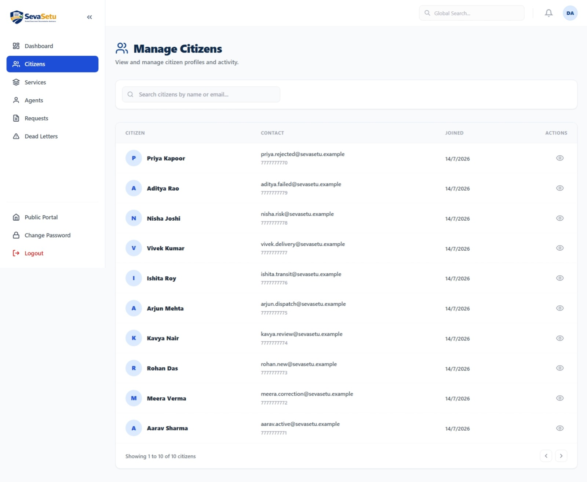
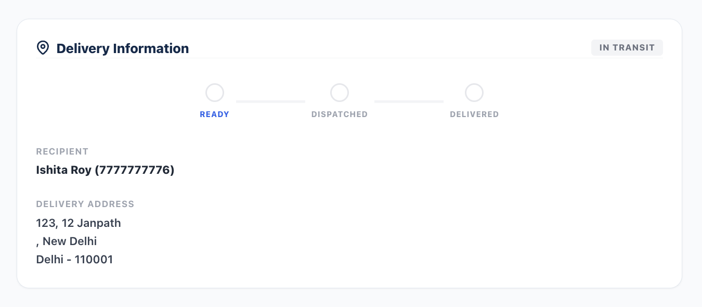

<div align="center">

# 🇮🇳 SevaSetu

### A Secure GovTech Platform for Citizen Service Applications, Secure Document Verification, Agent-Assisted Processing, and Transparent Service Delivery

**SevaSetu** is a full-stack GovTech workflow platform designed to simplify how citizens discover, apply for, track, and receive public services. The platform connects citizens with verified agents through secure document handling, structured application workflows, transparent status tracking, notifications, administrative oversight, and physical certificate delivery.

[Live Demo](#-live-demo) ·
[Features](#-key-features) ·
[Screenshots](#-screenshots) ·
[Architecture](#-system-architecture) ·
[Installation](#-local-development) ·
[Documentation](#-documentation) ·
[Future Scope](#-future-scope)

</div>

---

## 📌 About SevaSetu

Accessing public and administrative services can involve fragmented information, repeated physical visits, unclear application status, insecure document sharing, and limited communication between applicants and service providers.

**SevaSetu** demonstrates how these workflows can be managed through a centralized digital platform.

The platform connects three primary roles:

- **Citizens** discover services, submit applications, upload documents, receive corrections, track requests, and monitor delivery.
- **Agents** process assigned applications, review documents, request corrections, update application status, and manage delivery operations.
- **Administrators** manage services, users, agents, assignments, analytics, operational workflows, and platform oversight.

> **Disclaimer**
>
> SevaSetu is an independent software project demonstrating digital service workflow management. It is not an official government portal and is not currently integrated with official government databases such as Aadhaar or DigiLocker.

---

## ✨ Key Features

### 👤 Citizen Portal

- Secure account registration and authentication
- Email verification and password recovery
- Service discovery and search
- Detailed service information
- Application creation and submission
- Address information capture
- Secure document uploads
- Application history
- Request lifecycle tracking
- Document correction and resubmission workflow
- Persistent notification center
- Global toast notifications
- Delivery tracking
- Cash-on-Delivery status visibility
- Profile management
- Secure access to final documents

### 🧑‍💼 Agent Portal

- Agent authentication and approval workflow
- Personalized Agent dashboard
- Assigned request management
- Request search, filtering, and pagination
- Citizen application review
- Secure document access using signed URLs
- Document verification and rejection
- Correction request workflow
- Resubmitted document processing
- Application status management
- Verification report uploads
- Delivery workflow management
- COD collection tracking
- Agent notifications
- Profile and profile-photo management

### 🛡️ Admin Portal

- Administrative dashboard
- Platform analytics and statistics
- Citizen management
- Agent management
- Agent approval and status control
- Service catalog management
- Request monitoring
- Agent assignment and reassignment
- Search, filtering, and pagination
- Delivery oversight
- COD and payment-state monitoring
- Risk and verification review
- Notification center
- Audit visibility
- Background-job monitoring
- Dead-letter job inspection and replay

---

## 🔄 Application Lifecycle

SevaSetu manages service applications through a controlled state-based workflow.

```text
DRAFT
   ↓
SUBMITTED
   ↓
ASSIGNED
   ↓
UNDER_REVIEW
   ├──────────────→ REJECTED
   │
   ├──────────────→ CORRECTION_REQUIRED
   │                       ↓
   │                  RESUBMITTED
   │                       ↓
   │                  UNDER_REVIEW
   │
   ↓
APPROVED
   ↓
DELIVERY PROCESS
   ↓
COMPLETED

Citizen may withdraw eligible requests:

DRAFT / SUBMITTED → CANCELLED
```

This workflow prevents unauthorized status changes and provides traceability throughout the application lifecycle.

---

## 📦 Delivery & Cash-on-Delivery Workflow

SevaSetu models the transition between digital application processing and physical document delivery.

### Free Services

```text
Application Approved
        ↓
Ready for Dispatch
        ↓
Dispatched
        ↓
In Transit
        ↓
Out for Delivery
        ↓
Recipient Verification
        ↓
Secure Document Handover
        ↓
Delivered
```

### Paid Services

```text
Application Approved
        ↓
Ready for Dispatch
        ↓
Dispatched
        ↓
In Transit
        ↓
Out for Delivery
        ↓
Recipient Verification
        ↓
COD Collection
        ↓
Payment Confirmation
        ↓
Secure Document Handover
        ↓
Delivered
```

The current implementation uses **Cash on Delivery (COD)** instead of an online payment gateway.

Online payments are part of the future roadmap.

---

## 📄 Secure Document Workflow

Sensitive documents require controlled access.

SevaSetu implements the following document lifecycle:

```text
Citizen Upload
      ↓
Private Object Storage
      ↓
Document Metadata Created
      ↓
Agent Authorization Check
      ↓
Temporary Signed URL
      ↓
Document Review
      ↓
Verified
   OR
Rejected
      ↓
Correction Requested
      ↓
Citizen Uploads Replacement
      ↓
Previous Document Preserved for Audit History
```

### Storage Strategy

**Development**

```text
Local Filesystem
```

**Production**

```text
Cloudflare R2
      +
S3-Compatible AWS SDK
      +
Private Buckets
      +
Short-Lived Signed URLs
```

Sensitive files are never intentionally exposed through permanent public URLs.

---

## 🔔 Notification System

SevaSetu provides persistent database-backed notifications and global UI toast feedback.

Notifications can be generated for important platform events such as:

- Account registration
- Email verification
- Verification-link resend
- Application submission
- Agent assignment
- Document correction requests
- Document resubmission
- Application approval
- Application rejection
- Delivery updates
- COD status updates
- Application completion
- Administrative events

The notification center supports:

- Unread notification count
- Read/unread state
- Mark-as-read behavior
- Role-specific notifications
- Global toast alerts
- Notification navigation

---

## 🔐 Security Features

Security controls implemented in SevaSetu include:

| Security Area | Implementation |
|---|---|
| Password Security | Password hashing |
| Authentication | JWT access and refresh token architecture |
| Authorization | Role-Based Access Control |
| Resource Protection | Ownership and assignment checks |
| IDOR Protection | Server-side document authorization |
| Agent Security | Admin-controlled Agent approval |
| File Storage | Private Cloudflare R2 buckets |
| Document Access | Short-lived signed URLs |
| Application Workflow | Controlled state transitions |
| OTP Security | Expiration and attempt-limit architecture |
| Cron Security | Protected Cron endpoint |
| Background Processing | Retry and dead-letter handling |
| Duplicate Processing | Idempotency mechanisms |
| Secrets | Environment-variable configuration |
| Auditability | Historical application and document state preservation |

---

## 🏗️ System Architecture

```text
                         ┌─────────────────────┐
                         │      Citizens       │
                         └──────────┬──────────┘
                                    │
                         ┌──────────▼──────────┐
                         │       Agents        │
                         └──────────┬──────────┘
                                    │
                         ┌──────────▼──────────┐
                         │       Admins        │
                         └──────────┬──────────┘
                                    │
                                    ▼

┌─────────────────────────────────────────────────────────┐
│                    React + Vite Frontend                 │
│                                                         │
│ Landing Page │ Citizen Portal │ Agent Portal │ Admin UI │
└───────────────────────────┬─────────────────────────────┘
                            │
                            │ REST API
                            ▼
┌─────────────────────────────────────────────────────────┐
│                   Node.js + Express API                 │
│                                                         │
│ Authentication │ RBAC │ Requests │ Documents │ Delivery │
│ Notifications  │ Admin │ Agents   │ Jobs      │ Storage  │
└──────────┬──────────────────────┬───────────────────────┘
           │                      │
           ▼                      ▼

┌──────────────────────┐   ┌───────────────────────────┐
│    MongoDB Atlas     │   │      Cloudflare R2        │
│                      │   │                           │
│ Users                │   │ Private Documents         │
│ Services             │   │ Verification Reports      │
│ Requests             │   │ Final Certificates        │
│ Notifications        │   │                           │
│ Jobs                 │   │ Signed URL Access          │
│ Delivery Data        │   │                           │
└──────────────────────┘   └───────────────────────────┘

           │
           ▼

┌─────────────────────────────────────────────────────────┐
│                Background Job Architecture              │
│                                                         │
│ Business Event                                          │
│      ↓                                                  │
│ Outbox / Job Record                                     │
│      ↓                                                  │
│ Vercel Cron                                             │
│      ↓                                                  │
│ Scheduler Worker                                        │
│      ↓                                                  │
│ Delivery Worker                                         │
│      ↓                                                  │
│ Email / Notification Delivery                           │
│                                                         │
│ Failure → Retry → Dead Letter → Admin Review / Replay   │
└─────────────────────────────────────────────────────────┘
```

---

## 📸 Screenshots

> Screenshots will be added as the project UI evolves.

### Landing Page

<p align="center">
  
</p>

### Service Discovery

<p align="center">
  
</p>

### Citizen Dashboard

<p align="center">
  
</p>

### Service Application

<p align="center">
  
</p>

### Application Tracking

<p align="center">
  
</p>

### Citizen Notifications

<p align="center">
  
</p>

### Agent Dashboard

<p align="center">
  
</p>

### Agent Request Review

<p align="center">
  
</p>

### Admin Dashboard

<p align="center">
  
</p>

### Admin User Management

<p align="center">
  
</p>

### Delivery Tracking

<p align="center">
  
</p>

---

## 🛠️ Technology Stack

### Frontend

| Technology | Purpose |
|---|---|
| React | Component-based user interface |
| Vite | Development server and production build tooling |
| Tailwind CSS | Responsive UI styling |
| React Router | Client-side routing |
| Axios / HTTP Client | Backend API communication |

### Backend

| Technology | Purpose |
|---|---|
| Node.js | JavaScript runtime |
| Express.js | REST API framework |
| MongoDB | Primary database |
| Mongoose | MongoDB object modeling |
| JWT | Authentication |
| Password Hashing | Secure credential storage |
| Multer | Multipart file upload processing |
| AWS S3 SDK | Cloudflare R2 integration |
| SMTP | Transactional email delivery |

### Infrastructure

| Service | Purpose |
|---|---|
| Vercel | Frontend and serverless backend deployment |
| MongoDB Atlas | Managed production database |
| Cloudflare R2 | Private object storage |
| Vercel Cron | Scheduled background processing |
| SMTP Provider | Transactional emails |

---

## 🗂️ Project Structure

```text
SevaSetu/
│
├── api/
│   └── index.js
│
├── frontend/
│   ├── public/
│   ├── src/
│   │   ├── api/
│   │   ├── components/
│   │   ├── contexts/
│   │   ├── layouts/
│   │   ├── pages/
│   │   │   ├── admin/
│   │   │   ├── agent/
│   │   │   └── citizen/
│   │   └── routes/
│   └── package.json
│
├── src/
│   ├── config/
│   ├── middleware/
│   ├── modules/
│   ├── services/
│   ├── utils/
│   └── workers/
│
├── tests/
│   └── integration/
│
├── docs/
│   └── screenshots/
│
├── app.js
├── server.js
├── vercel.json
├── DEPLOYMENT.md
├── .env.example
└── package.json
```

---

## 🚀 Local Development

### Prerequisites

Install the following before running the project:

- Node.js
- npm
- MongoDB Atlas account or local MongoDB instance
- Git

Cloudflare R2 credentials are optional when using local storage mode.

### 1. Clone the Repository

```bash
git clone <YOUR_GITHUB_REPOSITORY_URL>
cd SevaSetu
```

### 2. Install Backend Dependencies

```bash
npm install
```

### 3. Install Frontend Dependencies

```bash
cd frontend
npm install
cd ..
```

### 4. Configure Environment Variables

Copy the environment template:

```bash
cp .env.example .env
```

Configure the required variables.

```env
NODE_ENV=development

MONGODB_URI=

JWT_ACCESS_SECRET=
JWT_REFRESH_SECRET=

DELIVERY_SECRET_ENCRYPTION_KEY=

FRONTEND_URL=http://localhost:5173
CORS_ORIGIN=http://localhost:5173

EMAIL_FROM=
SMTP_HOST=
SMTP_PORT=587
SMTP_SECURE=false
SMTP_USER=
SMTP_PASS=

STORAGE_PROVIDER=local

CRON_SECRET=
```

> Never commit `.env` files or production credentials.

### 5. Start the Backend

```bash
npm run dev
```

### 6. Start the Frontend

Open another terminal:

```bash
cd frontend
npm run dev
```

---

## 🧪 Testing

Run the complete backend regression suite:

```bash
npm run test:all
```

Run the standard test command:

```bash
npm test
```

Build the frontend for production:

```bash
cd frontend
npm run build
```

The project includes integration coverage for:

- Authentication
- Role-Based Access Control
- Citizen request workflows
- Admin controls
- Document authorization
- Citizen Portal
- Agent Portal
- Background jobs
- Serverless architecture
- Storage behavior

---

## ☁️ Deployment Architecture

SevaSetu uses separate frontend and backend deployment projects.

```text
GitHub Repository
       │
       ├───────────────┐
       │               │
       ▼               ▼

Frontend Vercel     Backend Vercel
Project             Project
       │               │
       │               ├───────────────┐
       │               │               │
       ▼               ▼               ▼

React SPA       Express API       Vercel Cron
                       │               │
                       ├───────┬───────┘
                       │       │
                       ▼       ▼

                MongoDB Atlas   Workers
                       │
                       ▼

                 Cloudflare R2
```

Detailed deployment instructions are available in:

```text
DEPLOYMENT.md
```

---

## ⚠️ Current Limitations

SevaSetu currently has several intentionally incomplete external integrations.

- SMS delivery is mocked for development.
- No online payment gateway is integrated.
- Paid services currently use Cash on Delivery.
- Courier tracking uses internal workflow states.
- No direct DigiLocker integration.
- No Aadhaar API integration.
- No official government database integration.
- Frontend automated testing is limited.
- End-to-end browser testing is planned.
- Advanced production observability is planned.

---

## 🔮 Future Scope

### Short Term

- Playwright or Cypress E2E testing
- Frontend component testing
- Accessibility improvements
- UI/UX refinement
- CI/CD pipeline
- API documentation
- Production monitoring and error tracking

### Medium Term

- Razorpay payment gateway
- Real SMS provider integration
- Courier API integration
- Progressive Web Application
- Multilingual interface
- OCR-based document extraction
- Advanced analytics
- Enhanced fraud-risk indicators

### Long Term

- DigiLocker integration
- Digital signatures and eSign
- Mobile applications
- AI-assisted document validation
- Anomaly detection
- Government department integrations
- Multi-tenant architecture
- White-label service portals
- Event-driven architecture
- Multi-region deployment

---

## 🎯 What This Project Demonstrates

SevaSetu demonstrates practical experience with:

- Full-stack application development
- React frontend architecture
- REST API development
- Node.js and Express backend architecture
- MongoDB schema design
- Multi-role authentication
- Role-Based Access Control
- Secure document handling
- Cloud object storage
- Signed URL architecture
- Application state machines
- Notification systems
- Background processing
- Retry mechanisms
- Dead-letter workflows
- Serverless architecture
- Cash-on-Delivery workflows
- Production configuration
- Integration testing
- Deployment preparation
- Repository security and hygiene

---

## 📚 Documentation

Additional project documentation can be maintained inside the `docs/` directory:

```text
docs/
├── SEVASETU_PROJECT_REPORT.md
├── SEVASETU_PROJECT_REPORT_SUMMARY.md
├── SEVASETU_TECHNICAL_ARCHITECTURE.md
├── SEVASETU_FEATURES_AND_WORKFLOWS.md
├── SEVASETU_FUTURE_SCOPE.md
├── SEVASETU_VIVA_GUIDE.md
├── SEVASETU_PRESENTATION_CONTENT.md
│
└── screenshots/
    ├── landing-page.png
    ├── service-discovery.png
    ├── citizen-dashboard.png
    ├── service-application.png
    ├── application-tracking.png
    ├── citizen-notifications.png
    ├── agent-dashboard.png
    ├── agent-request-review.png
    ├── admin-dashboard.png
    ├── admin-user-management.png
    └── delivery-tracking.png
```

---

## 🤝 Contributing

Contributions, suggestions, and improvements are welcome.

To contribute:

1. Fork the repository.
2. Create a feature branch.
3. Make your changes.
4. Run tests and verify the production build.
5. Commit your changes.
6. Push the branch.
7. Open a Pull Request.

---

## 🔒 Security Notice

Do not commit:

- `.env` files
- MongoDB connection strings
- JWT secrets
- SMTP credentials
- Cloudflare R2 credentials
- API tokens
- private user documents
- production database exports

If a security issue is discovered, report it privately rather than publishing sensitive exploit details in a public issue.

---

## 📜 License

This project is currently intended for educational, portfolio, and demonstration purposes.

Add a formal open-source license such as MIT before distributing or accepting external contributions.

---

## 👩‍💻 Author

**Anjali Sinha**

Full-Stack Developer

Built as a full-stack software engineering project demonstrating secure multi-role workflow management, cloud storage, serverless architecture, background processing, and production-oriented application design.

---

<div align="center">

### SevaSetu

**Connecting Citizens, Services, and Trusted Digital Workflows.**

⭐ If you find this project useful, consider starring the repository.

</div># Government-Certificate-Brokerage-Service-Platform
